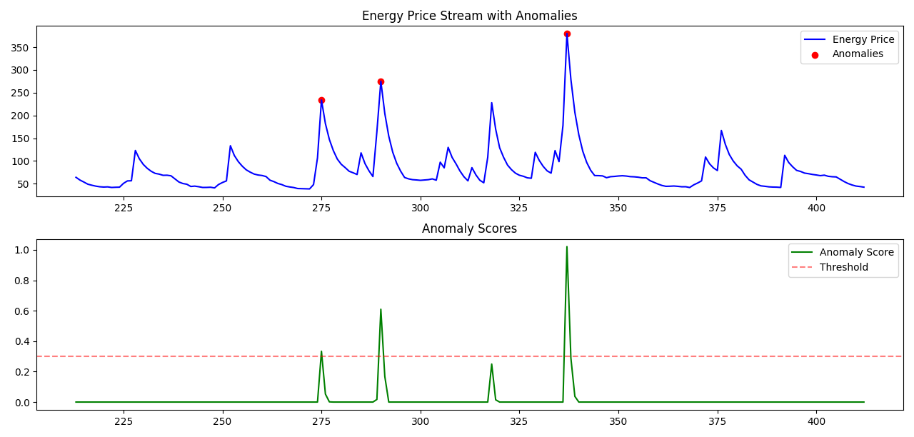

# Real-time anomaly detection using Random Cut Forest

## Abstract
The research project is a python-based implementation of the Random Cut Forest algorithm to detect anomalies and accurately flag them in streaming data. The script generates a real-time data stream for energy price, with regular patterns. It introduces seasonal patterns, random fluctuations and sudden spikes to somewhat simulate real-world data. The algorithm is then able to accurately detect and flag anomalies. This has been implemented using python version `3.12.3`

## Reason for choosing *Random Cut Forest*
When I started my research to find out which algorithm would fit best in this scenario, I had little idea because this was my first time dealing with a problem to detect anomalies, let alone detecting them in streaming data. I first looked at simple statistical algorithms like EWMA because the decision to choose the algorithm was mainly left up to the best interpretation of the requirements. After a bit more research, however, I found that simple statistical approaches might not be the best fit for this scenario, since we can have varying data with multiple dimensions and fine tuning simple approaches might not be the best idea.
I then started looking into machine learning algorithms and quickly found some that seem to fit the requirements quite well. Among those, was the **Isolation Forest** algorithm, which had all the right qualities for my need. I had initially decided to go with said algorithm but in doing more research and learning about how Isolation Forest works behind the scenes, I landed on a webpage that discussed Random Cut Forest for specifically detecting anomalies in real-time data.
After doing my research, keeping the requirements in mind, I concluded with the following points that caught my eye:
  1. **RCF is designed for streaming data**
      RCF was designed keeping real time data in mind, whereas IF needs to be modified to be able to fit streaming data as it was originally designed for static datasets. RCF provides immediate anomaly scores whereas the IF might lose some efficiency.
  2. **RCF automatically adapts to Concept Drift**
      IF in its original form, cannot automatically adapt to concept drift and requires a sliding window implementation to adapt. It also cannot inherently track seasonal changes and requires modification, whereas, RCF can naturally handle concept drift through reservoir sampling and can capture seasonal patterns through its forest structure. Although, the parameters might need to be tuned carefully.
  3. **Real-time Processing Speed and Efficiency**
      Isolation Forest *is* cheaper when it comes to detection but it was originally designed for batch processing and needs to be modified.

After reviewing the requirements once again, my interpretation of them lead me to choose Random Cut Forest algorithm. Random Cut Forest was developed at Amazon for streaming data and it is an unsupersived algorithm meaning it doesn't require any labelled data to start making predictions. This makes it particularly suitable for the project's requirements of handling real-time data streams with unknown patterns and anomalies.

## Objectives Covered
1. **Algorithm Selection:** For reasons listed above, I have decided to choose *Random Cut Forest (RCF)* as it is able to adapt to concept drift and seasonal variations while accurately marking anomalies.
2. **Data-Stream Simulation:** I have decided to simulate energy prices and designed the `EnergyDataSimulator` class with relevant member functions to generate regular data points, along with *seasonal patterns*, *random noise* and *occasional anomalies*.
3. **Anomaly Detection:** The `EnhancedAnomalyDetector` class is responsible for processing each new point that arrives from the stream and deciding whether it is an outlier or not. The constructor function initializes a random forest and the `process_point` function uses the random forest object add the point in the data and check whether it is an anomaly or not.
4. **Optimization:** The algorithm has been optimized to use data structures such as a double-ended queue (`deque`) ensure robust operations within the algorithm.
5. **Visualization:** `matplotlib` has been used to create a straight-forward visualization of anomalies. It displays two graphs. The top graph shows the energy price as data points while marking anomalies in red. The bottom graph shows the anomaly scores calculated by the algorithm along with the threshold. Any point that goes above the threshold line is also displayed accurately and marked as an anomaly in the top graph with a red dot.

## Requirements:
After carefully reviewing the requirements and interpreting them to the best of my ability, I have covered the following requirements:
1. **Python Version:** Implemented the algorithm using python version `3.12.3`
2. **Documentation and Comments** Carefully documented and explained key sections of the code with helpful comments.
3. **Concise Explanation:** Included an explanation of why I decided to choose Random Cut Forest algorithm to solve this problem and its effectiveness.
4. **Error Handling:** Ensured error handling and data validation wherever possible.
5. **Limited use of External Libraries:** I have not used an external library to implement the algorithm. I have implemented the algorithm to the best of my ability. The only two external libraries are `numpy` (for numerical computations) and `matplotlib` (for visualization). A `requirements.txt` file has been added.

## Usage:
To run the script, install all the required dependencies by running `pip install -r requirements.txt` in the project directory. Then, simply run the `simple-rcf-implementation.py` file. The script will generate a real-time data stream for energy prices and flag anomalies in the data. The script will also display the anomalies and their scores in a straight-forward visualization.

## Conclusion:
The implementation of Random Cut Forest for real-time anomaly detection has proven to be highly effective for streaming data analysis. Through careful algorithm selection and implementation, the project successfully demonstrates RCF's capability to handle concept drift and seasonal variations while maintaining computational efficiency. The visualization component provides clear insights into both the raw data and anomaly scores, making it easier to interpret the results.
While the current implementation focuses on energy price data, the algorithm's flexibility means it could be adapted for various other streaming data scenarios. The project maintains a balance between complexity and functionality, implementing core RCF concepts without unnecessary abstractions. Future improvements could include parameter auto-tuning capabilities and support for multivariate data streams and making the thresholding system dynamic, though the current implementation tries to successfully meets all initial requirements for real-time anomaly detection.

## Sample output:

## References:
1. https://d1.awsstatic.com/whitepapers/kinesis-anomaly-detection-on-streaming-data.pdf
2. https://docs.aws.amazon.com/sagemaker/latest/dg/randomcutforest.html
3. https://www.jmlr.org/papers/volume25/23-0570/23-0570.pdf
4. https://stackoverflow.com/questions/63115867/isolation-forest-vs-robust-random-cut-forest-in-outlier-detection
5. https://www.youtube.com/watch?v=9BWHR4JsTNU
6. https://www.youtube.com/watch?v=yx1vf3uapX8
7. https://github.com/aws/random-cut-forest-by-aws
8. https://christianalexander.com/2023/08/06/random-cut-forests-in-elixir/